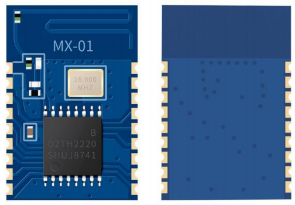

<!--
 Copyright (C) 2024 wwhai

 This program is free software: you can redistribute it and/or modify
 it under the terms of the GNU Affero General Public License as
 published by the Free Software Foundation, either version 3 of the
 License, or (at your option) any later version.

 This program is distributed in the hope that it will be useful,
 but WITHOUT ANY WARRANTY; without even the implied warranty of
 MERCHANTABILITY or FITNESS FOR A PARTICULAR PURPOSE.  See the
 GNU Affero General Public License for more details.

 You should have received a copy of the GNU Affero General Public License
 along with this program.  If not, see <https://www.gnu.org/licenses/>.
-->
# MX-01

MX-01 蓝牙模组是一款支持低功耗蓝牙协议的串口透传模组；模组具有小体积、高性能、高性价 比、低功耗、平台兼容性强等优点；可以帮助用户快速掌握蓝牙技术，加速产品开发；模组已兼容的 软件平台包括：IOS 应用程序、 Android 应用程序、微信小程序等。MCU 通过串口连接模组，可与手 机、平板等设备进行数据通讯，轻松实现智能无线控制和数据采集；模组广泛应用在智能家居、共享 售货机等领域。

